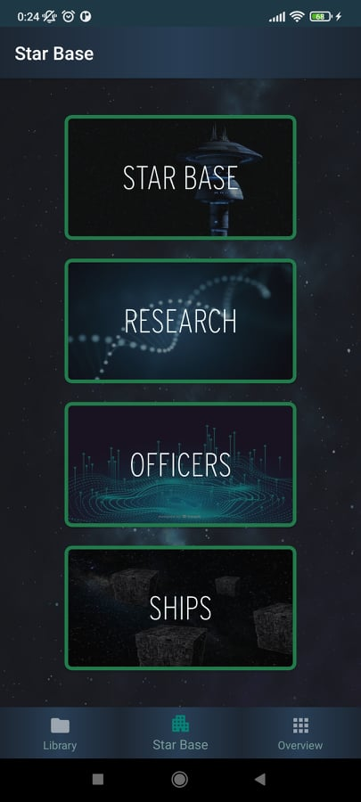
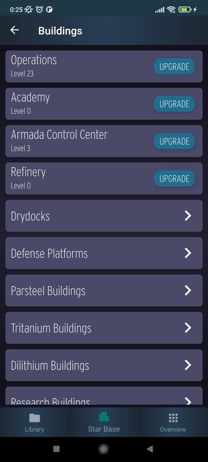
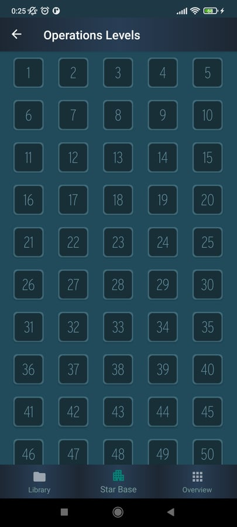
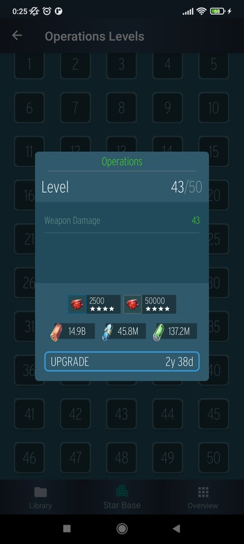
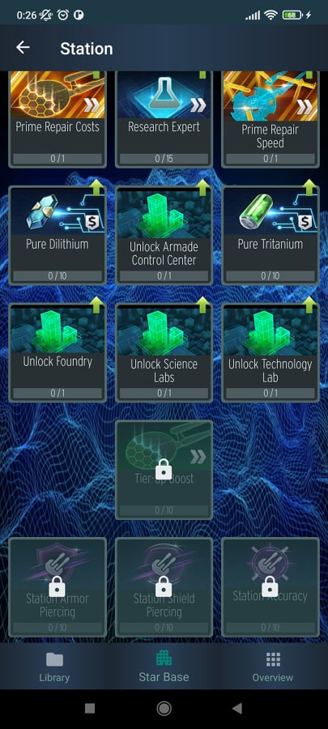
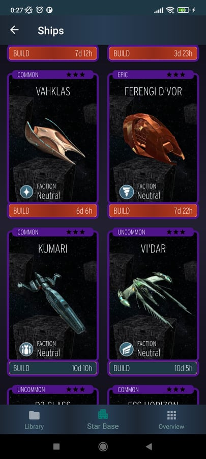
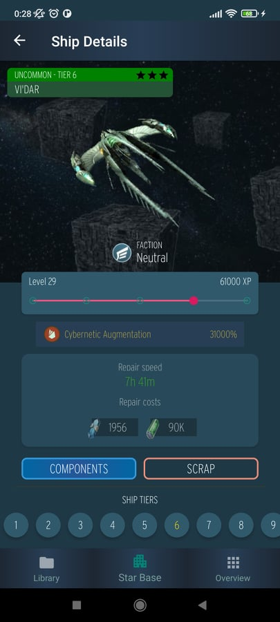
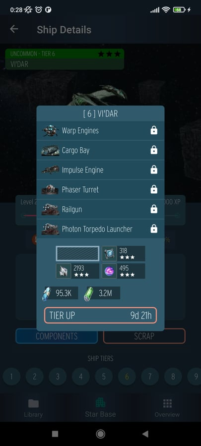
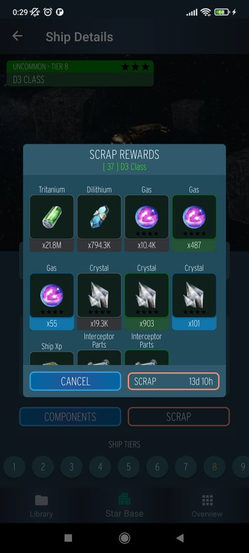
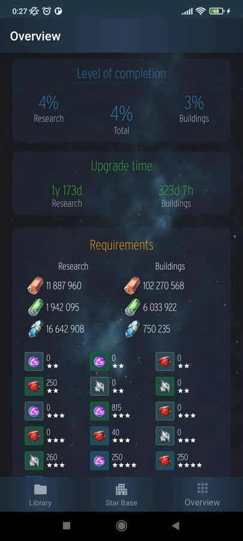

# Star Trek Fleet Command - Progress Tracker
User progress tracker for the Star Trek: Fleet Command game from Scopely.

The app provides information about the base aspects of the game such as costs, upgrade time and requirements based on your building and research levels and takes all efficiencies of your account into account.

Currently written in Java. Kotlin version is in Beta.

### Current supported content
- Buildings
- Research
- Ships

### Previews

